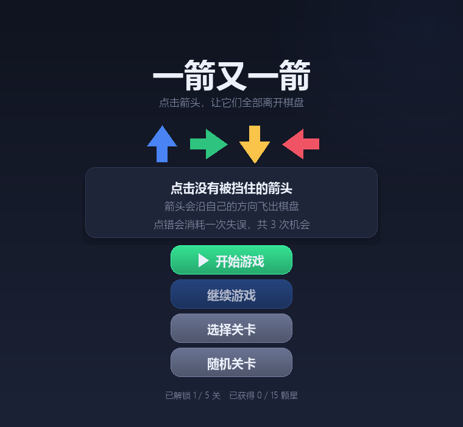
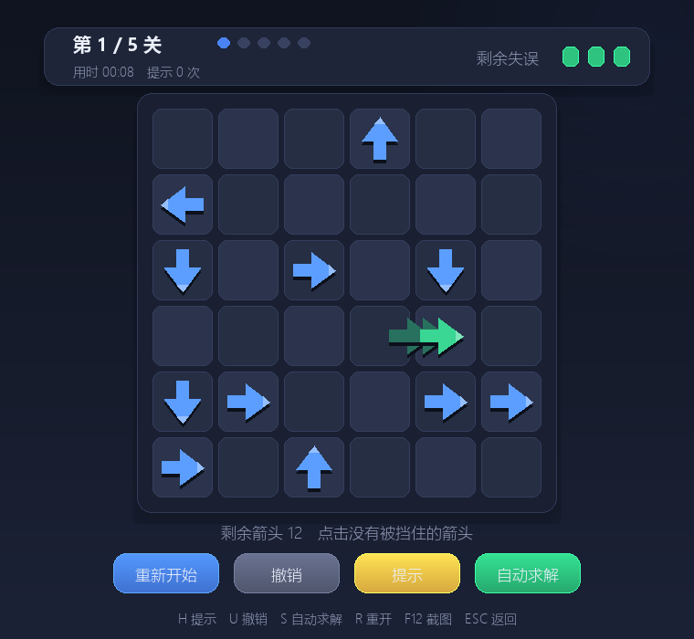
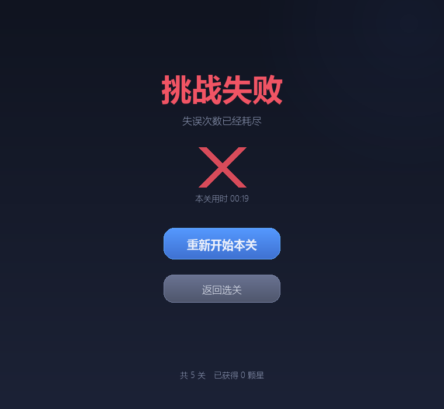

# 一箭又一箭

一款使用 Python 和 Pygame 开发的点击式箭头解谜小游戏。

玩家需要观察每个箭头的方向和前进路径，按照合适的顺序点击箭头，让棋盘上的箭头全部飞出棋盘。游戏共三个关卡，分别有 12、16、20 个箭头，可点的箭头从 4 个逐渐减少到 2 个，一关比一关难。

## 开发环境

- Python 3.12 及以上（本项目在 Python 3.14.7 上测试通过）
- pygame-ce 2.5.8（pygame 社区版，安装后导入名仍然是 `pygame`）
- Windows / macOS / Linux

## 安装方法

```bash
python -m pip install -r requirements.txt
```

下载缓慢时可以换用清华镜像：

```bash
python -m pip install -r requirements.txt -i https://pypi.tuna.tsinghua.edu.cn/simple
```

## 运行方法

```bash
python main.py
```

建议在命令行或 PyCharm 中运行，不要直接双击 `main.py`，这样出错时可以看到完整报错信息。

## 游戏操作

1. 在开始界面点击“开始游戏”；
2. 用鼠标点击棋盘中的箭头；
3. 箭头前方没有其他箭头时，箭头飞出棋盘并被消除；
4. 箭头前方有其他箭头时，箭头会变成红色并左右晃动，同时出现扩散圆环、粒子、音效和“前方有阻挡”提示，并消耗一次失误次数；
5. 失误次数耗尽后本关失败，可以重新开始本关；
6. 清除本关全部箭头后进入下一关，共三个关卡；
7. 按 `F12` 可以把当前画面截图保存到 `screenshots` 目录，按 `Esc` 退出游戏。

## 界面说明

界面是深色渐变背景加圆角卡片：顶部状态卡片显示关卡进度和剩余失误次数，棋盘用深浅交替的圆角格子，按钮是渐变色块并在鼠标悬停时变亮，通关界面按剩余失误次数点亮 1 到 3 颗星，失败界面显示一个叉。箭头不是图片，而是按方向用多边形算出来的三角形加短杆，带投影、高光和飞行尾迹，所有画面元素都由代码生成，仓库里不需要任何素材文件。

想改手感不用翻代码，所有可调数值都集中放在 `main.py` 开头的“可调参数”一节：

| 参数 | 作用 |
|---|---|
| `CARD_RADIUS` | 卡片圆角大小 |
| `TILE_GAP` | 棋盘格子之间的缝隙 |
| `ARROW_SCALE` | 箭头大小占格子的比例 |
| `PARTICLE_COUNT` / `PARTICLE_GRAVITY` / `PARTICLE_LIFE` | 碰撞粒子的数量、下落速度和寿命 |
| `SHAKE_AMPLITUDE` | 碰撞时箭头左右晃动的幅度 |
| `TONE_WAVE` | 音效波形，`triangle` 柔和、`sine` 更纯净、`square` 更复古 |
| `TONE_DECAY` | 每个音的衰减速度，越大越短促 |
| `WIN_NOTES` / `FAIL_NOTES` | 通关与失败旋律的音符表 |

## 项目文件

| 文件 | 说明 |
|---|---|
| `main.py` | 游戏主程序，包含界面绘制、路径检测、碰撞反馈和音效生成 |
| `requirements.txt` | 项目依赖 |
| `README.md` | 项目说明 |
| `tools/check_levels.py` | 关卡可解性校验脚本 |
| `screenshots/` | 游戏截图 |

## 游戏截图

### 开始界面



### 游戏界面



### 通关界面



## 关卡可解性

箭头只能在没有被挡住时点击，而点错只会消耗失误次数、棋盘不会变化，所以如果两个箭头互相挡住对方，这一关就会永远卡住。`tools/check_levels.py` 会检查每一个关卡是否真的能够清空：

```bash
python tools/check_levels.py
```

## AIGC 使用说明

开发过程中使用 AIGC 工具辅助完成了环境配置、程序结构设计、路径检测算法、碰撞反馈、界面改造、关卡设计和测试用例设计。所有生成代码均经过本人运行、调试和修改。
